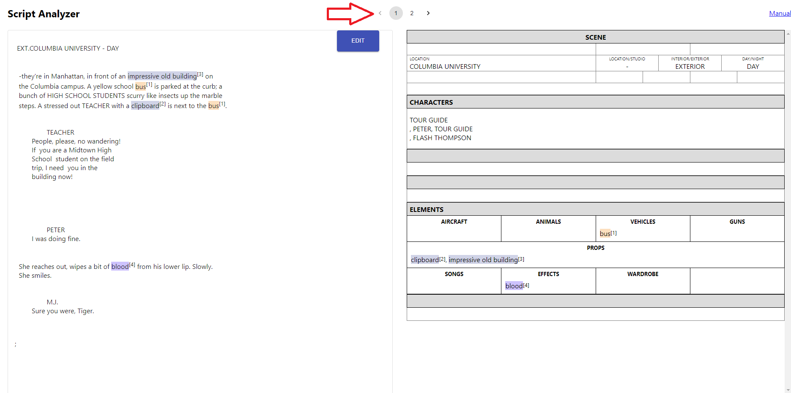
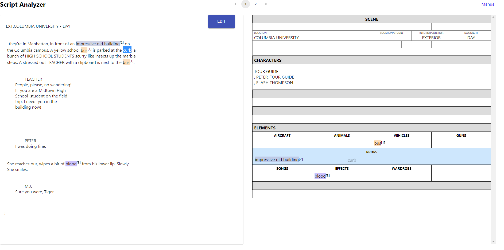

# Version: 0.2 (2021.01.14 released) 
[Japanese](./manual_jp.html "Hover Text")

## Restrictions 
- **Supported Language**: English  
- **Supported Format**: Final Draft (fdx), text file, and a spec script style text 
- **Supported Script Area**: headers and stage direction 
	- If there is the prop extracted from a stage direction on a dialog, it would be highlighted.
- **Supported Category with Internal Default Dictionaries**: AIRCRAFT, ANIMALS, VEHICLES, GUNS, PROPS, SONGS, EEFECTS, WARDROBE 
- **Preferred maximum number to analyze for once**: 10 scenes (General case, depending on the amount of document on each scripts)

## Features 
- Handling multi scene processing 
- Personalization of a custom dictionary 
	- Add and remove words to/from a custom dictionary 

## How to use
### **Analyze your script**
1.	Import your script 

**[Multi-Scene Processing]**
- Scenes will automatically be separated following header detections after clicking analyze button

(A) Click the open file button and you can select a file to upload

 

(B) Copy and paste a spec script style text to the form

**[Caution] Please include a header for the first line**

 

2.	Click the analyze button

 

3.	Check the result

**[Multi-Scene Processing]**
- Switch scenes and their results by clicking number buttons or direction arrows on the top

 

 

***

### **Edit your script** 
- Currently, the edit button appears only after clicking the analyze button. 
- Plus, only the entire script which includes all scenes is available to edit.

1.  Click the edit button, then you can edit the script

 

2.	Click the analyze button

 

***

### **Customize your dictionary**
1.	Set your custom dictionary name with editing the end of URL **“/id/****”**
**[Caution] Without setting your name (https://dny5q9airvsek.cloudfront.net/), you can analyze your script, but you cannot use custom dictionary functions.**
	- Default: test_user

 

2. Select your preferred ways to add to/remove from a custom dictionary

- (A) Word Highlight on the Script (no change on the result before analyzing it again)
- (B) Word Drag and Drop from the Script to the Breakdown Sheet (add to the result and your dictionary)
- (C) Word Click on the Breakdown Sheet (remove from the result and your dictionary)

#### (A) Word Highlight on the Script (no change on the result before analyzing it again)
1. Highlight a word to add to/remove from a custom dictionary using your cursor after analyzing your script  

 

2.	Select your action (Add/Remove) and one category

 

#### (B) Word Drag and Drop from the Script to the Breakdown Sheet (add to the result and your dictionary)

1.  Highlight a word and drag it from the script

 

2. Drop it to the breakdown sheet  

 

#### (C) Word Click on the Breakdown Sheet (remove from the result and your dictionary)

1. Bring your cursor to a word, click it, and then remove it

 

2. The word will be removed from the analyzed script, the result, and your dictionary

 