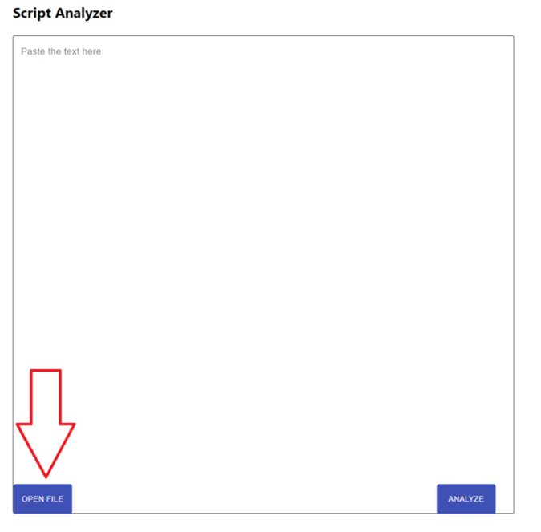
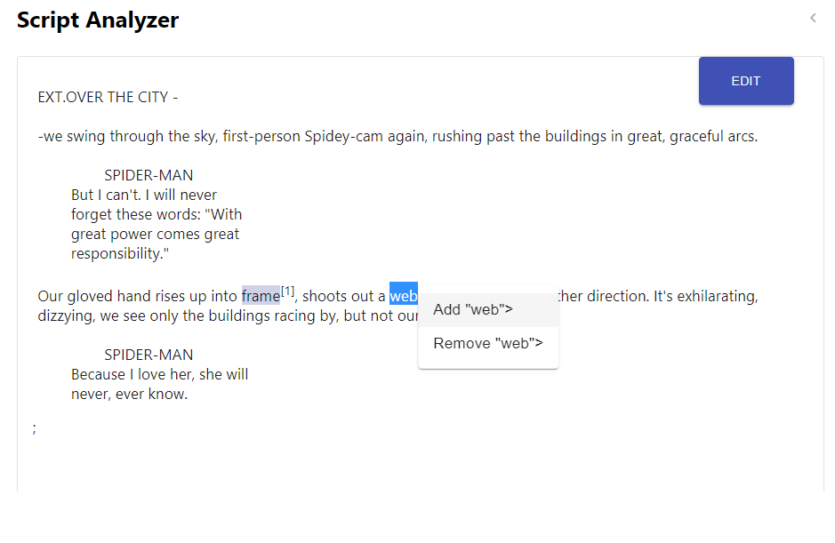
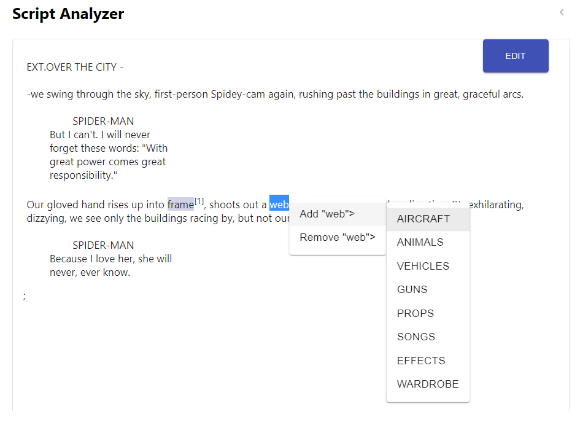
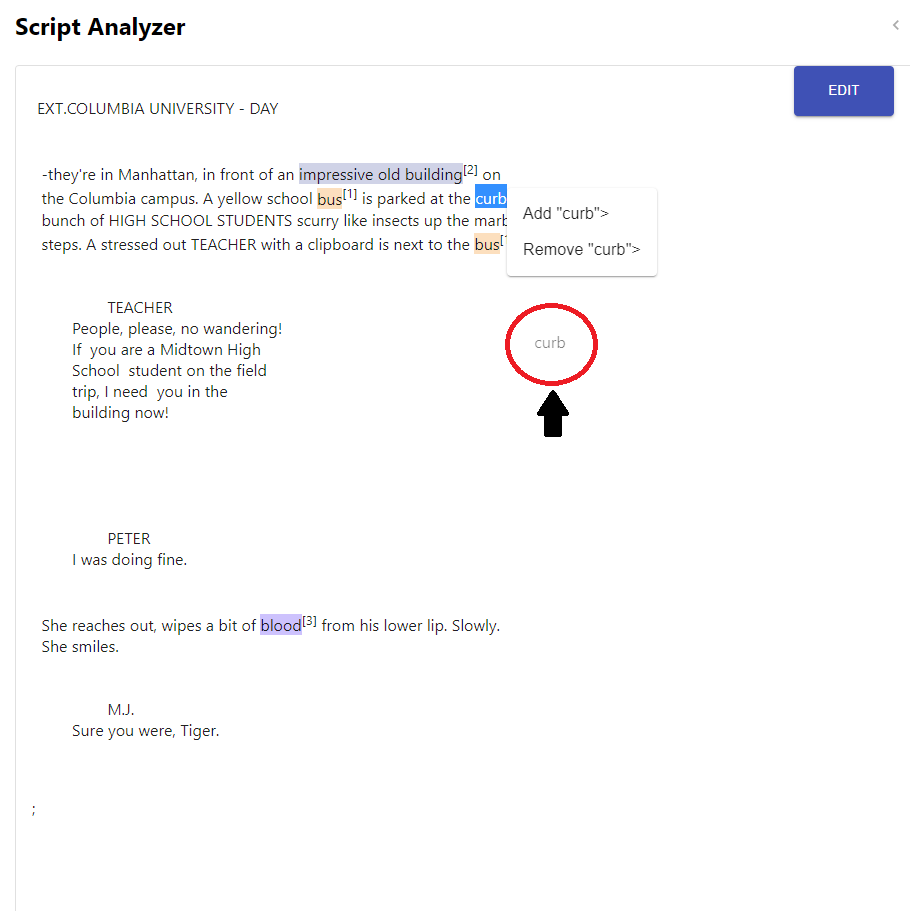
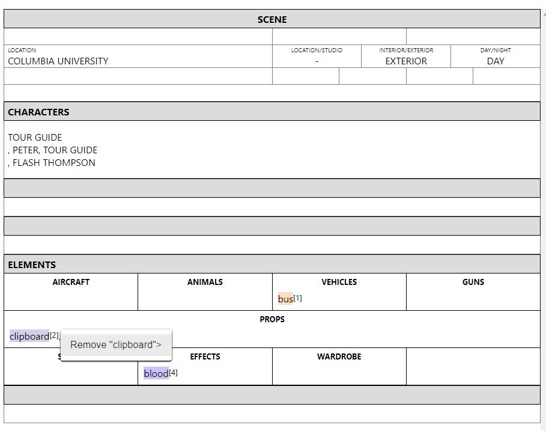

# Version: 0.2 (2021.01.14 released) 
[English](./manual_en.html  "Hover Text")

## 制約事項 
- **対応言語**: 英語  
- **対応形式**: Final Draft (fdx)、テキストファイル、スペックスクリプトスタイルのテキスト  
- **対応スクリプト領域**: headers and stage direction
    - ト書きから抽出されたプロップがセリフ上にある場合は、ハイライト表示されます。
- **デフォルト辞書でサポートされているカテゴリ**: AIRCRAFT, ANIMALS, VEHICLES, GUNS, PROPS, SONGS, EEFECTS, WARDROBE 
- **一度に分析する推奨最大数**: 10 シーン（一般的なケース、各スクリプトの文章量に依存）

## 特徴 
- マルチシーン処理の取り扱い
- ユーザ辞書のパーソナライズ
	- ユーザ辞書に単語を追加/削除します 

## 使い方
### **Analyze your script**
1.	スクリプトをインポートする

**[マルチシーン処理]**
- [解析] ボタンをクリックすると、ヘッダ検出後にシーンが自動的に分離されます。

(A) (A) [ファイルを開く] ボタンをクリックすると、アップロードするファイルを選択できます  

 

(B)スペックスクリプトスタイルのテキストをコピーしてフォームに貼り付ける

**[注意] 最初の行にヘッダーを含めてください**

 

2.	[解析] ボタンをクリックします

 

3.	解析結果

**[マルチシーン処理]**
- シーンとその結果を切り替える：上部の番号ボタンまたは方向矢印をクリックします。

 

 

***

### **スクリプトを編集する** 
- 現状、 [解析] ボタンをクリックした後でのみ表示されます。
- また、シーン分割後ではなく入力した全てのスクリプトが表示されます。

1.	編集ボタンをクリックすると、スクリプトを編集できます

 

2.	[解析] ボタンをクリックします

 

***

### **辞書のカスタマイズ**
1.	URL末尾の米印部分「/id /****」を編集して、ユーザ辞書名を設定します 

** [注意] 名前を設定しないと (https://dny5q9airvsek.cloudfront.net/)、スクリプトは解析できますが、カスタム辞書に関連する機能は使用できません。***

	- デフォルト： test_user

 

2. ユーザー辞書に追加またはユーザー辞書から削除する方法を選択します。

- (A) スクリプト上の単語をハイライト (再解析前の結果に変更なし)
- (B) スクリプトからブレークダウン・シートへ単語のドラッグ・アンド・ドロップ (結果と辞書への追加)
- (C) ブレークダウンシートの単語をクリック (結果と辞書から削除)

#### (A) スクリプト上の単語をハイライト (結果は変更されず、再度解析後に反映されます)

1.	脚本の解析後に、 ユーザ辞書に追加/削除する単語をカーソルでハイライト表示する

 

2.	処理 (追加/削除) とカテゴリ（１つ）を選択する

 

#### (B) スクリプトからブレークダウン・シートへ単語のドラッグ・アンド・ドロップ (結果と辞書に追加)

1. 単語をハイライト表示してスクリプトからドラッグする

 

2. ブレークダウンシートにドロップする

 

#### (C) ブレークダウンシートの単語をクリック (結果と辞書から削除)

1. 削除する単語にカーソルを合わせてクリックし、削除ボタンを選択
する
 

2. 単語は、解析されたスクリプト、結果、および辞書から削除される

 